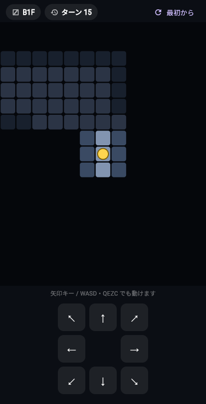

# Mystery Dungeon（仮）— Flutter ローグライク

「トルネコの大冒険3 不思議のダンジョン」を参考にした、ローグライクゲームを Flutter で開発しています。
最終的にはスマートフォンのネイティブアプリを目指し、**段階的に**作っていきます。

A roguelike game inspired by *Torneko / Mystery Dungeon*, built with Flutter and developed step by step.

> 開発方針の詳細は [`CLAUDE.md`](CLAUDE.md) を参照してください。

## いまの状態（第一段階）

**マップ生成と移動の土台**ができています。敵・アイテム・戦闘はまだありません。

- 🗺️ 入るたびに地形が変わる**自動生成ダンジョン**（部屋＋通路）
- 🚶 キャラクターが**ターン制で1マスずつ移動**（8方向／壁の角はすり抜けない）
- 🔦 **フォグ（霧）**：歩いて見た場所だけ明るくなる（不思議のダンジョン風の視界）
- 🪜 **下り階段**に乗ると次のフロアへ（地形が作り直される）
- 🎮 画面のボタン操作（PC では矢印キー / `WASD` / `QEZC` でも移動可）

| はじまりの部屋 | 探索中（フォグ＝霧） |
| :---: | :---: |
|  |  |

## 動かし方

```bash
flutter pub get
flutter run -d chrome
```

Web 用にビルドする場合：

```bash
flutter build web --release --no-web-resources-cdn
```

> ネットワーク制限のある環境では `--no-web-resources-cdn` を付けて、
> CanvasKit（描画エンジン）をローカルに同梱してください。

## テスト

```bash
flutter analyze
flutter test
```

- `test/dungeon_test.dart` … 生成された地図が正しいか（全床がスタートからつながっているか等）
- `test/game_screen_test.dart` … 移動とターンの基本動作

## 構成

```
lib/main.dart         アプリの入口
lib/dungeon.dart      地図データと自動生成ロジック
lib/game_screen.dart  描画・入力・ターン管理
lib/legacy/           最初に試作した○×ゲーム（保管用）
```

## 補足：最初の試作（○×ゲーム）

要件が大まかだった頃に作った Tic-Tac-Toe は `lib/legacy/` に残しています。
単独で動かす場合：

```bash
flutter run -d chrome -t lib/legacy/tic_tac_toe.dart
```
