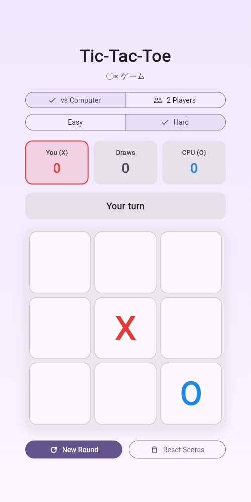

# Tic-Tac-Toe（○× ゲーム）

Flutter で作った Tic-Tac-Toe（三目並べ / ○×ゲーム）です。Web（Chrome）で動作します。

A polished Tic-Tac-Toe game built with Flutter, running on the web (Chrome).



## 特長 / Features

- 🤖 **vs Computer** — `Easy`（ランダム）と `Hard`（ミニマックス法・無敵）の難易度を選択
- 👥 **2 Players** — 2人で対戦
- 🏆 勝敗・引き分けのスコア記録、勝ったラインのハイライト
- 🎨 Material 3 デザイン、アニメーション付き
- ✅ ウィジェットテスト付き

## 必要環境 / Requirements

- [Flutter](https://docs.flutter.dev/get-started/install) (stable, 3.44 以降 / Dart 3.12+)
- Chrome（Web 実行・確認用）

## 実行方法 / Run

```bash
flutter pub get

# Chrome で起動 / Launch in Chrome
flutter run -d chrome
```

ブラウザ用にビルドする場合 / Build for the web:

```bash
flutter build web --release
# 出力 / Output: build/web/
```

> ネットワークが制限された環境では、CanvasKit をローカルに同梱する
> `--no-web-resources-cdn` を付けてビルドしてください。
> In restricted-network environments, build with `--no-web-resources-cdn`
> so CanvasKit is bundled locally instead of fetched from a CDN.

## テスト / Tests

```bash
flutter test
flutter analyze
```

## 構成 / Project structure

```
lib/main.dart          # ゲーム本体（UI + ロジック + ミニマックス AI）
test/widget_test.dart  # ウィジェットテスト
web/                   # Web 用エントリポイント
docs/screenshot.png    # スクリーンショット
```

## 遊び方 / How to play

1. 画面上部で対戦モード（`vs Computer` / `2 Players`）と難易度を選びます。
2. マスをタップして ○× を置きます（あなたは X、先手）。
3. 縦・横・斜めのいずれかを 3 つそろえると勝ちです。
4. `New Round` で盤面リセット、`Reset Scores` でスコアもリセットします。
